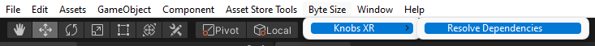
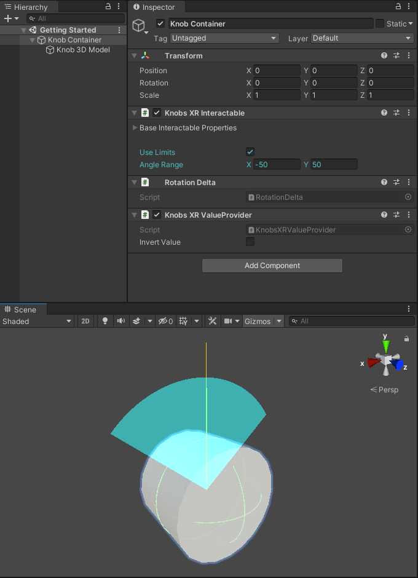
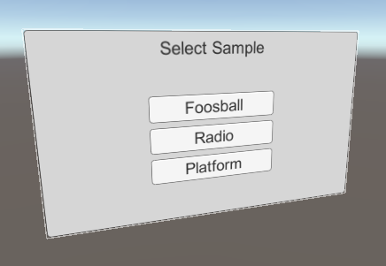

# Knobs XR by Byte Size


## Getting Started
Knobs XR is a Unity tool which allows you to easily add functioning knobs to your VR project.

### Prerequisites
- Unity Editor Version 2019.4 and later
- XR Interaction Toolkit 2.0.0 or higher
- XR Plugin Management 4.0.7 or higher
- Input System 1.2.0 or higher

In order for Knobs XR scripts to compile you will need the packages XR Interaction Toolkit 2.0.0 or higher and XR Plugin Management 4.0.7 or higher in your project. Consequently, Knobs XR is only supported on Unity Editor version 2019.4 and later since it is required by these packages. You can add the required packages through the Package Manager or by simply running the Dependency Resolver tool included with Knobs XR. 

The Dependency Resolver tool can be found in the toolbar under Byte Size > Knobs XR > Resolve Dependencies.



Once you click on Resolve Dependencies, you will be prompted to add or upgrade the XR Interaction Toolkit and XR Plugin Management packages depending on whether they are available in your project or if they are an incompatible version. Please make sure you have backed up your project before adding or upgrading these packages.

 


If you accept to add or upgrade the packages, the Dependency Resolver will automatically add or upgrade the required packages for you. You will see a console message when the Dependency Resolver has finished adding the packages.

> ⚠️ Please do not run the Dependency Resolver tool again while it is in the process of adding or upgrading the packages as it can cause unintended effects to your project.


If you get a warning about using Unity's new input system, please do so by selecting "Yes" on the warning input. The sample scenes require the new input system to interaction with the selection screen menu and knobs. Note: uou must have the new input system enabled and have the legacy input system disabled. Selecting "Yes" on the warning popup should do this for you.


Additionally, you might be asked to update the XR Interaction Layer Mask. Please go ahead and select "I Made a Backup, Go Ahead!" once you have made a backup of your project to update the interaction layer masks.


Once all the required packages have been added, either manually or through the Dependency Resolver, the Knobs XR scripts will compile and you can now use them in your project. Head over to [Adding A Knob](#adding-a-knob-🎛️) to get started.

### Adding A Knob 🎛️
To add a knob into your project, please adhere the following procedure:
1. Create an empty GameObject. This will be your knob container so name it accordingly e.g. "Knob Container".

    

1. Add your knob 3D model as a child of the knob container and name it accordingly e.g. "Knob 3D Model".

    

    Note: Your knob 3D model must have a collider attached so it is interactable with the OpenXR system.
    

1. Add the `Knobs XR Interactable` script (Byte Size > Knobs XR > Knobs XR Interactable) to the knob container GameObject. The `Rotation Delta` and `Knobs XR ValueProvider` will also be added as they are required by `Knobs XR Interactable`. In the scene, note the yellow "up" line that is shown when you select the knob container GameObject and have Gizmos enabled. You will use this line to orient your knob 3D model.

    

1. The knob container will rotate around it's blue axis line. As a result, the yellow "up" line indicates how much the knob has rotated around the blue axis line.

    

    Orient your knob 3D model within the knob container such that the forward face of the knob model points exactly in the same direction as the knob container's blue axis line. Similarly, the "zero" position of the knob 3D model should line up with the yellow "up" line. Doing so will ensure your knob 3D model appears to rotate accordingly with the rotation contraints and rotation value of the knob container.
    

1. You are now ready to start using the knob in your VR environment as long as you have setup OpenXR interactions!

### Specifying Knob Rotation Limits
By default, the knob you created in the [Adding A Knob](#adding-a-knob-🎛️) section will rotate freely around the knob container's blue axis direction. If you want to limit how much the knob can rotate in either direction, simply toggle the `Use Limits` property in the `Knobs XR Interactable` component. Once `Use Limits` is toggled, the `Angle Range` property will appear. You can use the `Angle Range` property to adjust the rotation limits of the knob. The `X` value represents how much the knob can rotate from the yellow "up" line counter-clockwise. Similarly, the `Y` value represents how much the knob can rotate from the yellow "up" line clockwise. You can verify your rotation limit constraint with the blue overlay on the knob. The blue area within the overlay indicates how much the knob can rotate around in either direction.



### Integrating Knob With Other Components
Once you have the knob in your scene and are able to rotate it you can use it to drive other components in the scene. There are two main ways you can use the knob:

- [Use the Knob Container's transform](#using-knob-containers-transform) to rotate objects with the knob (no code required)
- [Use the Knob Container's `Knobs XR ValueProvider`](#using-knob-containers-knobs-xr-valueprovider) to act on the knob's rotation programmatically

> ⚠️ Using the Knob Container as a child to a parent that is able to freely rotate at runtime, e.g. a knob on a door that can be opened, is currently not supported. However, it is in the roadmap and should be supported in future versions of Knobs XR.

#### Using Knob Container's Transform
If you only want to rotate an object along with the knob you can have the object as a child of the knob, similar to how you set up the knob 3D model. This way, each time the Knob Container is rotated, the child object will also be rotated. You can see use of this feature in the `Sample Scene - Foosball` scene. If you want to rotate an object with the knob but do not want to have it as a child of the knob you can bind the Knob Container's rotation value via `Knobs XR ValueProvider` to any rotation axis of the object. See [Knobs XR ValueProvider section](#using-knob-containers-knobs-xr-valueprovider) for more information on the `Knobs XR ValueProvider`.

#### Using Knob Container's Knobs XR ValueProvider
You can use the `Knobs XR ValueProvider` to have components programmatically react to the knob's rotation. For example, you can have the knob control the volume of a radio (see `Sample Scene - Radio`) or have a platform rotate from multiple knobs (see `Sample Scene - Platform`). To start using the `Knobs XR ValueProvider`, create a reference in your script:

```c#
using ByteSize.KnobsXR;
.
.
.
// In your script's class
// Get a reference in inspector via SerializeField or GetComponent
private KnobsXRValueProvider knobValue;
```

Once you have a reference of `Knobs XR ValueProvider` you can get the knob value through the `Knobs XR ValueProvider.KnobValue` property field.

```c#
audioSource.volume = knobValue.KnobValue;
```

Additionally, you can use `Knobs XR ValueProvider.MinValue` and `Knobs XR ValueProvider.MaxValue` to get the minimum and maximum knob value, respectively, based on the `Use Limits Angle Range` you specified in the `Knobs XR Interactable` inspector.

```c#
// Set volume starting at 0 up to max knob rotation
audioSource.volume = Mathf.InverseLerp(0f, this.knobValue.MaxValue, this.knobValue.KnobValue);
```

Finally, the `Invert Value` toggle allows you to invert the knob value. For example, toggling `Invert Value` and rotating the knob clockwise will result in a negative value.

### Sample Scenes
The Knobs XR package comes with three samples scenes, which you can use to reference how you can use Knobs XR in your projects. Although there is a limited number of samples, there are endless number of ways you can use Knobs XR in your projects.

If you want play any of the sample scenes, please run the bootloader scene (`\Assets\Byte Size\Knobs XR\Samples\Bootloader`) and select the sample scenes through the sample scene selection menu. During gameplay, you can bring up the sample scene selection menu anytime by pressing the primary button on your right-hand controller and select a sample scene by pressing the right-hand controller trigger. You will have to include all the sample scenes in your Scenes In Build section in the Build Settings window.

 

Each sample scene demonstrates an example of how you could use Knobs XR.

- `Knobs XR/Samples/Sample Scene - Foosball`

    Demonstrate how you can use Knobs XR to create an interactable foosball table.
    
- `Knobs XR/Samples/Sample Scene - Platform`

    Demonstrate how you can use two Knobs XR to control a single platform's rotation to move a ball around.
    
- `Knobs XR/Samples/Sample Scene - Radio`

    Demonstrate how Knobs XR can be used to control a radio's volume.
    